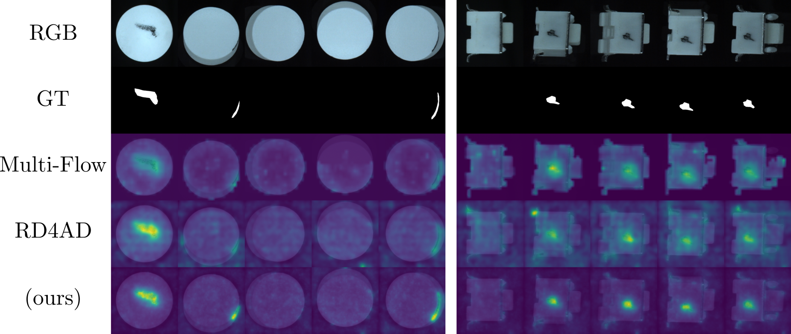
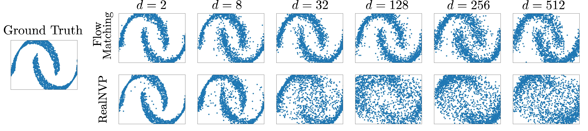

# MATCH: Flow Matching for Multi-View Anomaly Detection

This is the repository to the paper "MATCH: Flow Matching for Multi-View Anomaly Detection"
by Mathis Kruse, Melissa Schween, and Bodo Rosenhahn which was accepted to ECCV 2026

Code is expected to be released by September, together with the start of the conference.

## Abstract
>Detecting anomalies in industrial objects is an important topic for increasing production efficiency. More complex objects often require the analysis of several view points, which has led to the field of multi-view anomaly detection. We present MATCH, the first multi-view anomaly detection method based on Flow Matching (FM). With the ODE formulation of Flow Matching, we can estimate likelihoods and thereby derive an anomaly score to detect anomalies in multi-view image data at object, image, and pixel-level. The architectural flexibility of FM models allows us to efficiently transform features of different spatial sizes to the normal distribution. We evaluate thoroughly on the already established Real-IAD data set and are also the first to provide a comprehensive evaluation of popular anomaly detection methods for the MANTA-Tiny data set. MATCH achieves state-of-the-art performance in both anomaly detection and segmentation, all while running on consumer-level hardware. By omitting the costly divergence term needed for likelihood estimation, we ensure that MATCH is usable in real-time production scenarios. Lastly, several ablation studies are conducted to validate the methodological choices.

